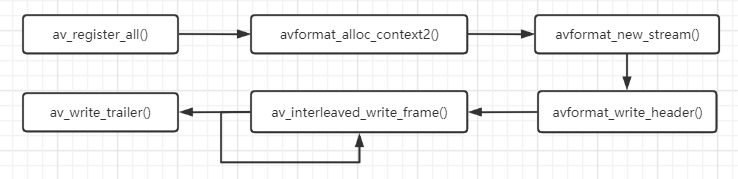

# FFmpeg


ffmpeg 是一套可以用来记录、转换数字音频、视频，并能将其转化为流的开源计算机程序。它包括了领先的音/视频编码库。

- libavformat：用于各种音视频封装格式的生成和解析，包括获取解码所需信息以生成解码上下文结构和读取音视频帧等功能；
- libavcodec：用于各种类型声音/图像编解码；
- libavutil：包含一些公共的工具函数；
- libswscale：用于视频场景比例缩放、色彩映射转换；
- libpostproc：用于后期效果处理；
- ffmpeg：该项目提供的一个工具，可用于格式转换、解码或电视卡即时编码等；
- ffsever：一个 HTTP 多媒体即时广播串流服务器；
- ffplay：是一个简单的播放器，使用ffmpeg 库解析和解码，通过SDL显示；


## av_format

| class | 描述 |
| --------------- | ------------------  |
| AVFormatContext | 这个结构体描述了一个媒体文件或媒体的构成和基本信息 |
| AVCodecContext | 这是一个描述编解码器上下文的数据结构，包含了众多编解码器需要的参数信 |
| AVCodec | 存储编码器信息的结构体 ，结构体具体内容 |
| AVFrame |结构体一般用于存储原始数据（即非压缩数据，例如对视频来说是YUV，RGB，对音频来说是PCM），此外还包含了一些相关的信息。比如说，解码的时候存储了宏块类型表，QP表，运动矢量表等数据。编码的时候也存储了相关的数据。因此在使用FFMPEG进行码流分析的时候，AVFrame是一个很重要的结构体。 |
| AVPacket | 存储压缩编码数据相关信息的结构体 |
| SwsContext | 结构体主要用于视频图像的转换，主要用两个函数来实现对结构体的操作：sws_scale，sws_getContext |
| AVstream | 存储每一个视频、音频流信息的结构体 |
| AVIOContext | 管理输入输出数据的结构体 |

### 调用顺序



```c++
#函数介绍
avformat_alloc_output_context2()
    初始化输出上下文
avformat_free_context()
    释放输出上下文
avformat_new_stream()
    申请新的数据流
avcodec_parameters_copy()
    copy参数
avformat_write_header()
    生成多媒体文件头
av_write_frame()/av_interleaved_write_frame()
    写入数据
av_write_trailer()
    写入尾部
```

示例：

```c++
/*
api注册
*/
av_register_all();

/* 
(2)申请AVFormatContext
在使用FFmpeg进行，封装格式相关操作时，需要使用AVFormat作为操作的上下文线索
*/
AVOutputFotmat *fmt;
AVFormatcontext * oc;
avformat_alloc_output_context2();//初始化输出上下文
if(!oc)
{
    printf("cannot alloc flv format\n");
    return 1;
}
fmt = oc->oformat;


/*
(3)申请AVStream
申请一个将要写入的AVStream流，AVStream流将主要作为存放音频、视频、字幕数据流使用：
*/
AVStream *st;
AVCodecContext *c;
st = avformat_new_stream(oc,NULL);
if(!ost->st)
{
    fprintf(stderr,"Could not allocate stream\n");
    exit(1);
}
st->id = oc->nb_streams-1;
// 至此。需要将Codec与AVStream进行对应，可以根据视频的编码参数对AVCodecContext的参数进行设置：
c->codec_id = codec_id;
c->bit_rate = 400000;
c->width = 352;
c->height = 288;
st->time_base = (AVRational){1,25};
c->time_base = st->time_base;
c->gop_size = 12;
c->pix_fmt = AV_PIX_FMT_YUV420P;
// 然后为了兼容新版本的FFnpeg的AVCodecparameters结构，需要做一个参数copy操作：
ret = avcodec_parameters_from_context(ost->st->codecpar,c);
if(ret < 0)
{
    printf("Counld not copy the stream paramters\n");
    exit(1);
}


/*
(4)增加目标容器的头信息
在操作封装格式时，有些封装格式需要写入头不信息，所以在FFmpeg写封装数据时，需要先写封装格式的头部：
*/
ret = avformat_write_header(oc,&pkt)；
if(ret < 0)
{
    printf("Error occurred when opending output file:%s\n",av_err2str(ret));
    return 1;
}

/*
(5)写入帧数据
在FFmpeg操作数据包时，均采用写帧操作进行音视频数据包的写人，而每一帧在常规情况下均使用AVPacket结构进行音视频数据的存储，AVPacket 结构中包含了PTS
DTS、Data等信息，数据在写人封装中时，会根据封装的特性写人对应的信息:
*/
AVFormatContext *ifmt ctx = NULL;
AVIOContext* read_in =avio_alloc_context(inbuffer, 32 * 1024 ,0 ，NULL,get input_ buf fer, NULL, NULL) ;//avio_alloc_context是ffmpeg中用来读写buffer的函数，根据读写需求分配函数参数
if(read in= =NULL)
    goto end ;
ifmt_ ctx->pb=read_in;
ifmt_ctx->flags=AVFMT_FLAG_CUSTOM_IO;
if ((ret = avformat_ open_ input(&ifmt_ ctx, "h264", NULL, NULL)) < 0) 
{
    av_log(NULL,AV_LOG_ERROR,"Cannot get h264 memory data\n")；
    return ret;
}
while(1)
{
    AVPacket pkt = {0};
    av_init_packet(&pkt);
    ret = av_read_frame(ifmt_ctx,&pkt);
    if(ret < 0)
    {
        break;
    }
    av_packet_rescale_ts(pkt,*time_base,st->time_base);
    pkt->stream_index = st->index;
    return av_interleaved_write_frame(fmt_ctx,pkt);
}

/*
(6)写容器尾信息
在写人数据即将结束时，将会进行收尾工作，例如写人封装格式的结束标记等，例如FLV的sequence end标识等:
*/
avformat_close_input (&fmt_ ctx);

```


